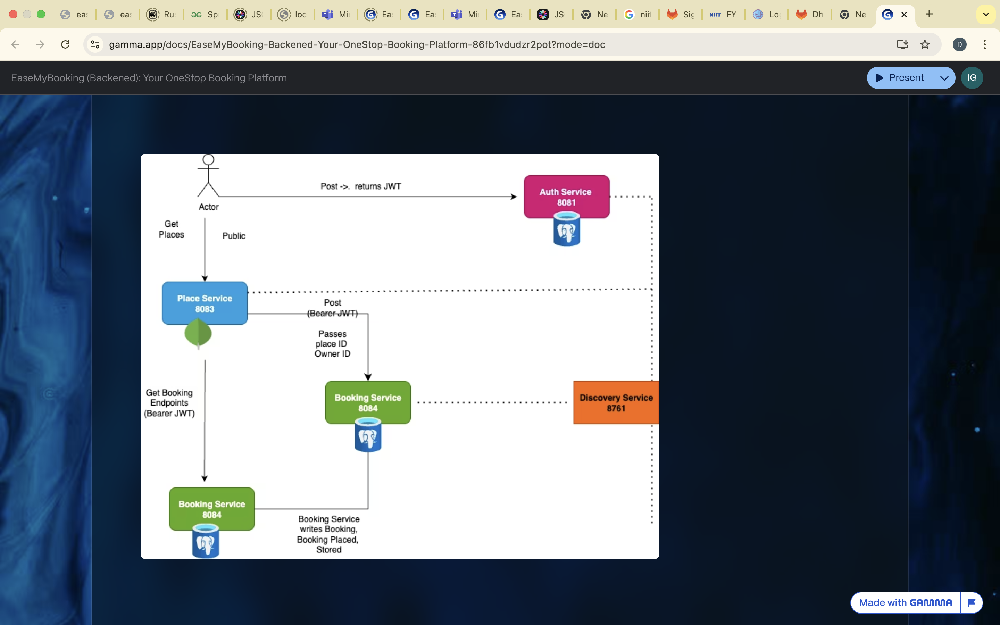

# EaseMyBooking 🎟️

EaseMyBooking is an online ticket booking platform that allows users to discover tourist places (zoos, museums, parks, monuments, etc.) and purchase entry tickets without standing in long queues. It also enables place owners to register their venues, making them discoverable to tourists and increasing profitability.

---

## 📌 Problem Statement
Visiting popular tourist attractions often involves standing in long queues at ticket counters. EaseMyBooking solves this by providing:
- A centralized platform for **place owners** to list their venues.
- A seamless experience for **visitors** to book tickets online.
- Improved **discoverability** and **profitability** for venue owners.

---

## 🚀 Features
- User authentication and authorization with JWT tokens.
- Search and discover nearby places.
- Online ticket booking system.
- Place owner dashboard for managing listings.
- Secure payments (future integration).
- Responsive UI across multiple devices.

---

## 🛠️ Tools & Technologies
- **Version Control**: GitLab
- **Backend**: Spring Boot 3 (REST APIs)
- **Database**: MongoDB / MySQL
- **Build Tool**: Maven
- **Testing**: JUnit, Mockito
- **Containerization**: Docker & Docker Compose

---

## 📊 Project Milestones
1. Backend and database integration.
2. CI/CD setup with containerization.
3. Security implementation (JWT, role-based access).

---

## 📷 Screenshots & Architecture
_Add your project screenshots or diagrams here:_

  
*System design showcasing microservices and database integration.*

  
*User journey for discovering and booking tickets.*

  
*Place owner’s dashboard for managing listings.*

---

## 📂 Project Structure

EaseMyBooking/
├── auth-service/ # Authentication & user management
├── place-service/ # Place registration & management
├── booking-service/ # Ticket booking and transactions
├── gateway-service/ # API Gateway (security + routing)
├── common/ # Shared DTOs and utilities
└── README.md # Project documentation
